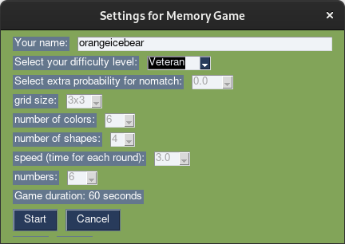

# ByThePowerOfMemory
Memory Training Game

Multidimensional Memory Game

## how to install:

see requirements.txt

 - install python
 - install pysimplegui using the command 

`pip install pysimplegui`

- run the game using:

`python ByThePowerOfMemory.py`

## how to play:

The game presents the player for one minute several figures. Each figure has a position (on a grid), a color, a shape and a number (in the center of the figure). 

The task of the player is to remember all 4 attributres of a figure (position, color, shape and number) and as soon as the next figure is shown to click the corresponding button(s) to indicate that the new figure has same attributes as the previous figure.
Instead of the buttons also key presses can be used (a,s,d,f).

## Screenshots

This game was created during a python programming course at https://spielend-programmieren.at 
